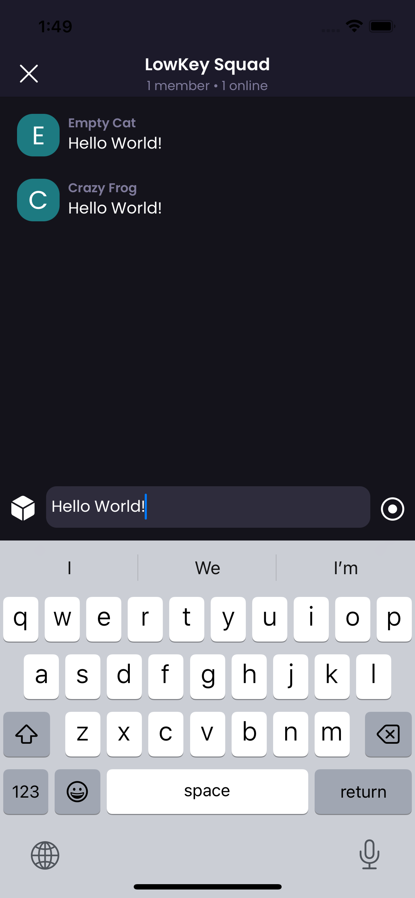
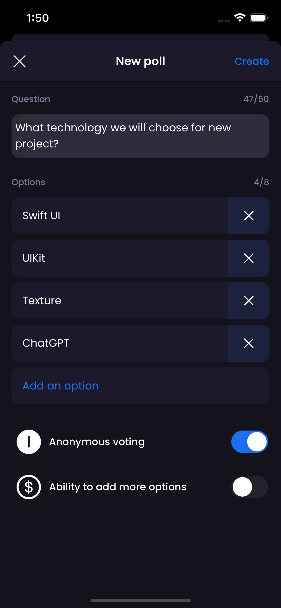
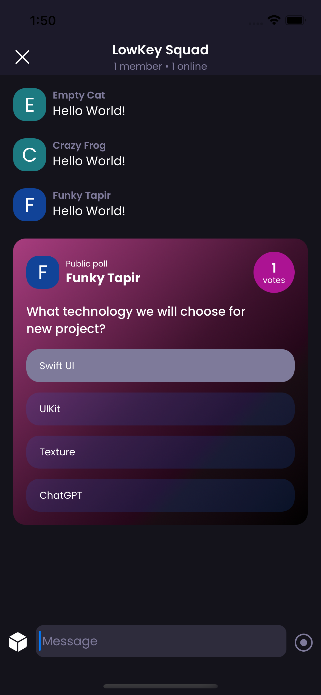

## Requirements
* Design - https://xd.adobe.com/view/7c8ee6e8-78da-4ebc-adcd-e051033b0ba4-29dd/flow/
* Create a message list screen with two different message types: text and poll 
* Navigation between chat screen and poll creation
* Poll creation. Don’t worry about switches. Just adding new options and send it to the chat
* You can use any suitable icons
* Font is: https://fonts.google.com/specimen/Poppins
* No need databases or any extra work, you can just mock data in array
* Use any tools and technologies that will help you

## Result

### Screenshots

MessageList             |  PollCreator| MessageList with Poll
:-:                     |:-:          |:-:
  |   | 

### Dependencies
* [Factory](https://github.com/hmlongco/Factory) - for DI and future scalability
* [SFSafeSymbols](https://github.com/SFSafeSymbols/SFSafeSymbols) - for safe obtaining enumerated SFSymbols
